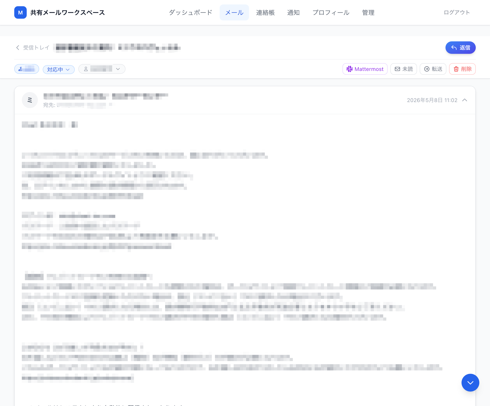
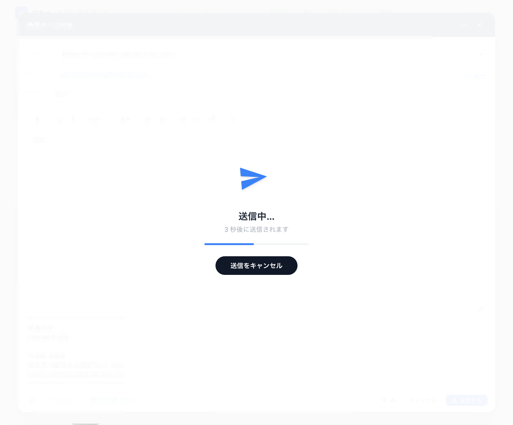
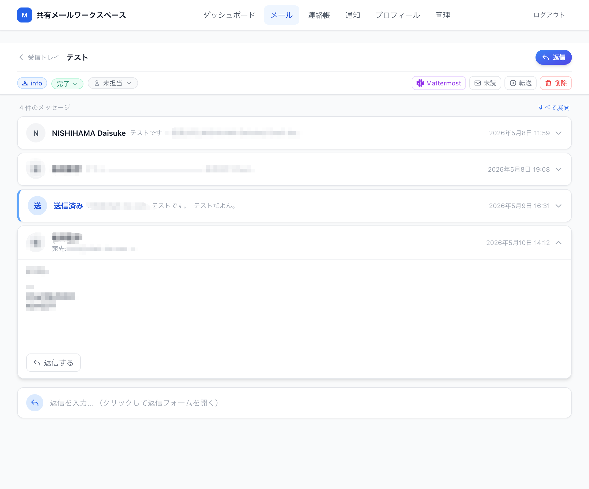
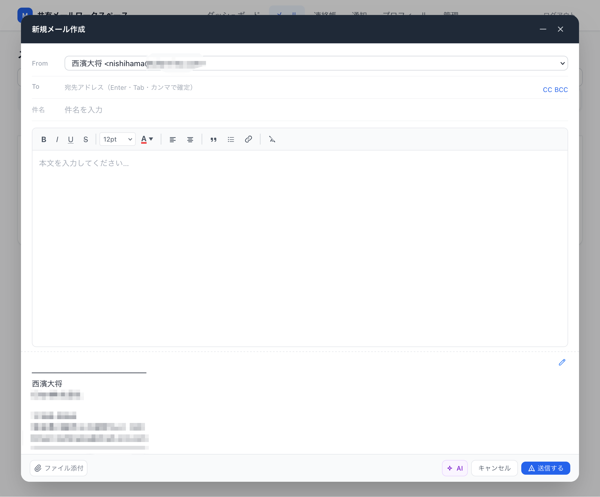
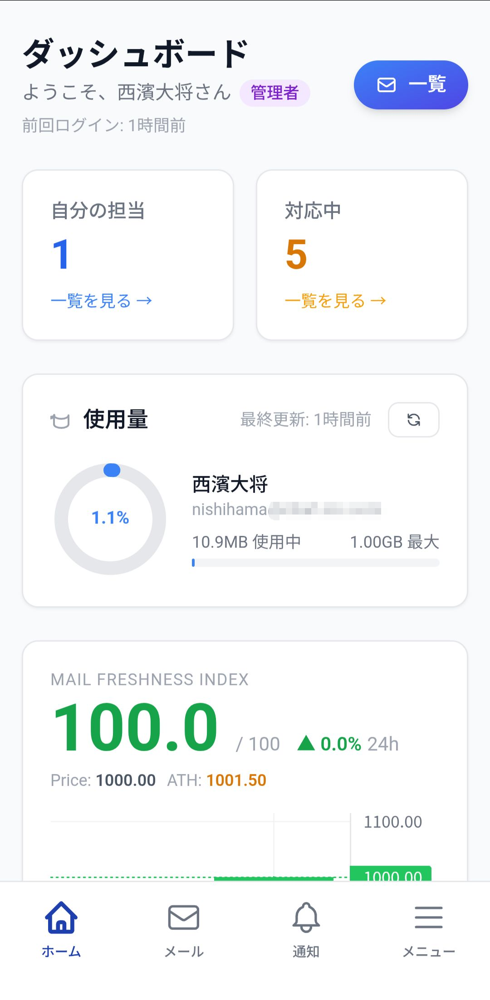
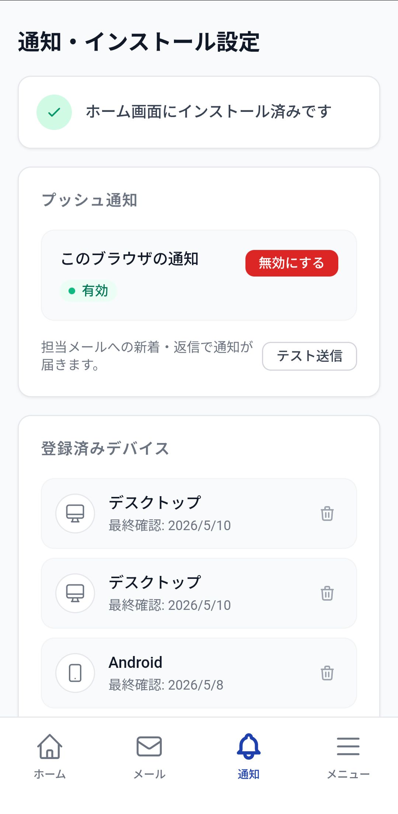
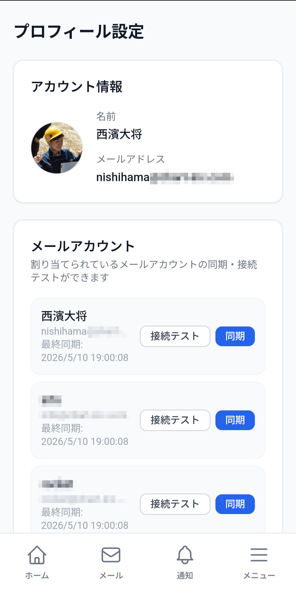

<div align="center">


# 📬 Shared Webmail App

**社内向け共有メール運用システム**

チームで1つのメールアカウントを共有し、

担当割り当て・ステータス管理・返信をシームレスに。

[](https://nextjs.org/)
[](https://www.typescriptlang.org/)
[](https://www.postgresql.org/)
[](https://www.prisma.io/)
[](https://tailwindcss.com/)

</div>

> <br />

***

## 概要

複数のスタッフが同一のメールアカウントを共有し、対応漏れを防ぐための社内ツールです。\
受信メールをスレッドとして管理し、担当者の割り当て・ステータス管理・返信を一元化します。

```
受信メール → スレッド自動生成 → 担当者割り当て → 返信 → クローズ
```

他にも同時編集機能やAI返信支援、Web Push通知など、チームでのメール対応を効率化する機能を多数搭載しています。

社内コミュニケーションツールMattermostとの連携や、Google連絡帳との同期も可能です。

<div align="center">
  

  
</div>

***

## 機能

| カテゴリ    | 機能                                            |
| ------- | --------------------------------------------- |
| **メール** | IMAP同期（差分取得）/ SMTP送信 / スレッド自動統合 / 添付ファイル      |
| **管理**  | 担当者割り当て / ステータス管理（未対応・対応中・完了） / アーカイブ         |
| **権限**  | 管理者・一般ユーザーのRBAC / メールボックスごとの閲覧・返信・担当変更権限      |
| **通知**  | Web Push通知（PWA・VAPID） / Mattermost転送          |
| **認証**  | パスワード認証 / パスキー（Touch ID / Face ID / セキュリティキー） |
| **AI**  | OpenRouter経由でのAI返信文生成・校正                      |
| **その他** | 下書き自動保存 / Google連絡帳同期 / 監査ログ                  |

***

## デザイン

### PC版

<table>
  <tr>
    <td></td>
    <td></td>
  </tr>
  <tr>
    <td></td>
    <td></td>
  </tr>
</table>

### スマホ版

<table>
  <tr>
    <td align="center"></td>
    <td align="center"></td>
    <td align="center"></td>
    <td align="center"></td>
  </tr>
</table>

***

## 技術スタック

```
┌─────────────────────────────────────────┐
│  Browser (PWA + Service Worker)         │
├─────────────────────────────────────────┤
│  Next.js 16  ·  React 18  ·  Tailwind   │
├─────────────────────────────────────────┤
│  Route Handlers  ·  Edge Middleware     │
├─────────────────────────────────────────┤
│  PostgreSQL 16  ·  Prisma ORM           │
├─────────────────────────────────────────┤
│  imapflow  ·  nodemailer  ·  web-push   │
└─────────────────────────────────────────┘
```

| 用途       | ライブラリ                                  |
| -------- | -------------------------------------- |
| フレームワーク  | Next.js 16 (App Router)                |
| DB / ORM | PostgreSQL 16 + Prisma 5               |
| セッション    | iron-webcrypto (AES-GCM sealed cookie) |
| IMAP受信   | imapflow                               |
| SMTP送信   | nodemailer                             |
| メール解析    | mailparser                             |
| 暗号化      | AES-256-GCM (Web Crypto API)           |
| Push通知   | web-push (VAPID)                       |
| パスキー     | @simplewebauthn                        |
| バリデーション  | zod                                    |
| テスト      | Vitest                                 |

***

## クイックスタート

### 前提

* Node.js 20+

* PostgreSQL 16

### 1. セットアップ

```bash
# 依存パッケージのインストール
npm install

# 環境変数の設定
cp .env.example .env
```

`.env` を編集して最低限以下を設定してください：

```env
DATABASE_URL="postgresql://your_user@localhost:5432/webmail_app?schema=public"
SESSION_SECRET="$(openssl rand -base64 48)"
ENCRYPTION_KEY_HEX="$(openssl rand -hex 32)"
```

### 2. DB初期化

```bash
# PostgreSQLにデータベースを作成
createdb webmail_app

# マイグレーション実行
npx prisma migrate dev

# 初期管理者ユーザーを作成
node prisma/seed.mjs
```

### 3. 起動

```bash
npm run dev
```

`http://localhost:3000` にアクセスし、以下でログイン：

```
Email:    admin@example.com
Password: admin1234
```

***

## 本番デプロイ

### 自動セットアップ（Ubuntu 22.04 / 24.04）

Node.js・PostgreSQL・Nginx・PM2・HTTPS（Let's Encrypt）まで一括で設定します。

```bash
sudo bash scripts/production-setup.sh
```

### 更新デプロイ

```bash
bash scripts/deploy.sh
# git pull → npm ci → prisma migrate deploy → npm run build → pm2 reload
```

***

## 環境変数

| 変数名                   |  必須 | 説明                            |
| --------------------- | :-: | ----------------------------- |
| `DATABASE_URL`        |  ✅  | PostgreSQL接続URL               |
| `SESSION_SECRET`      |  ✅  | セッション暗号化キー（32文字以上）            |
| `ENCRYPTION_KEY_HEX`  |  ✅  | メールパスワード暗号化キー（64桁hex）         |
| `NEXT_PUBLIC_APP_URL` |  ✅  | アプリのURL（HTTPSならSecure Cookie） |
| `OPENROUTER_API_KEY`  |  —  | AI返信機能（管理画面でも設定可）             |
| `VAPID_PUBLIC_KEY`    |  —  | Web Push通知（管理画面で自動生成可）        |
| `MATTERMOST_BASE_URL` |  —  | Mattermost連携（管理画面でも設定可）       |
| `CRON_SECRET`         |  —  | 定期同期エンドポイントの認証トークン            |

全変数の一覧は [`.env.example`](./.env.example) を参照してください。

***

## DBスキーマ変更

```bash
# 1. prisma/schema.prisma を編集
# 2. マイグレーション作成
npx prisma migrate dev --name <変更名>
# 3. クライアント再生成（migrate dev が内部で実行するが、明示的に実行することを推奨）
npx prisma generate
```

> **本番環境では必ず** **`migrate deploy`** **を使用してください。`migrate dev`** **はDBをリセットする場合があります。**

***

## npm スクリプト

```bash
npm run dev          # 開発サーバー（Hot Reload）
npm run build        # 本番ビルド
npm run start        # 本番サーバー起動
npm run test         # Vitestでテスト実行
npm run typecheck    # TypeScript型チェック
```

***

## ディレクトリ構成

```
webmail-app/
├── prisma/              # DBスキーマ・マイグレーション・シードデータ
├── public/              # Service Worker・PWAマニフェスト
├── scripts/
│   ├── production-setup.sh   # 本番初期セットアップ
│   └── deploy.sh             # 更新デプロイ
├── src/
│   ├── app/             # Next.js App Router（画面・APIルート）
│   │   ├── (app)/       # 認証済みページ
│   │   └── api/         # Route Handlers
│   ├── components/      # 共通コンポーネント
│   └── lib/             # ビジネスロジック・ユーティリティ
│       └── mail/        # IMAP同期・SMTP送信
├── storage/
│   └── attachments/     # 添付ファイル保存先
└── docs/                # 設計ドキュメント
```

***

## トラブルシューティング

**`The column 'xxx' does not exist`**

```bash
npx prisma migrate deploy  # 本番
npx prisma migrate dev     # 開発
npx prisma generate        # クライアント再生成
```

**`Can't reach database server`**

```bash
brew services start postgresql@16   # macOS
sudo systemctl start postgresql     # Linux
```

**Push通知が届かない**\
→ 管理画面 (`/admin/settings`) で VAPID鍵を生成・保存してください。

**AI返信ボタンが出ない**\
→ 管理画面でOpenRouter APIキーを設定してください。

<div align="center">

Built with Next.js · PostgreSQL · Prisma · Tailwind CSS

</div>
