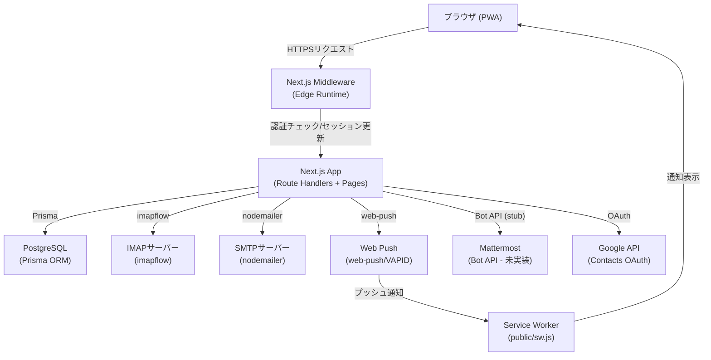

# プロジェクト概要

> 最終更新: 2026-04-12

---

## システムの目的

IMAP/SMTPベースの社内向け**共有メール運用システム**。チームメールの担当管理・状態管理・Mattermost連携・Web Push通知を実装したMVP。

複数スタッフが同一メールアカウントを共有し、担当割り当て・既読管理・ステータス管理を行うことを主目的とする。個人メールアカウントも管理対象とする。

---

## 技術スタック

| レイヤー | 技術・バージョン |
|---|---|
| フロントエンド | Next.js ^16.2.3 (App Router), React 18, TypeScript ^5.4.5 |
| スタイリング | Tailwind CSS ^3.4.19 |
| バックエンド | Next.js Route Handlers (Node.js runtime) |
| Middleware | Next.js Middleware (Edge runtime互換) |
| DB | PostgreSQL 16 + Prisma ORM ^5.13.0 |
| セッション | iron-webcrypto ^0.10.1 (cookie sealed session) |
| メール受信 | imapflow ^1.0.164 (IMAP) |
| メール送信 | nodemailer ^8.0.5 (SMTP) |
| メール解析 | mailparser ^3.9.0 |
| 暗号化 | AES-256-GCM (Node.js `webcrypto`) |
| PWA | Service Worker + Web Push (web-push ^3.6.6, VAPID) |
| パスキー | @simplewebauthn/browser, @simplewebauthn/server ^13.3.0 |
| バリデーション | zod ^3.23.8 |
| テスト | Vitest ^4.1.4 |

---

## 全体アーキテクチャ概要



---

## 主要機能一覧

| 機能 | 実装状況 | 説明 |
|---|---|---|
| メールアカウント管理 | ✅ | 個人・共有（チーム）メールボックス作成・設定 |
| IMAP同期 | ✅ | 差分取得・スレッド統合・添付保存 |
| SMTP送信 | ✅ | 返信・新規作成 |
| スレッド管理 | ✅ | 一覧・詳細・ステータス変更 |
| 担当者管理 | ✅ | スレッドへのユーザー割り当て |
| アクセス権限管理 | ✅ | 閲覧/返信/担当変更の3段階権限 |
| Web Push通知 | ✅ | 新着メール通知（VAPID） |
| パスキー認証 | ✅ | WebAuthn (Touch ID / Face ID / セキュリティキー) |
| 下書き保存 | ✅ | 自動保存（デバウンス1.5秒） |
| コンタクト管理 | ✅ | 手動・Google連携 |
| 監査ログ | ✅ | 操作履歴記録 |
| Mattermost連携 | 🚧 | UI・APIのみ実装、Bot API通信は未実装 |
| パスワードリセット | ✅ | トークンベース |
| ユーザー管理 | ✅ | 管理者のみ作成・編集可 |

---

## 責務分離

| 責務 | 実装箇所 |
|---|---|
| 認証・セッション管理 | `src/middleware.ts`, `src/lib/auth.ts` |
| 認可（RBAC） | `src/lib/rbac.ts`, 各Route Handler内 |
| IMAP受信・同期 | `src/lib/mail/sync.ts`, `src/workers/sync.ts` |
| SMTP送信 | `src/lib/mail/smtp.ts`, `src/workers/send.ts` |
| スレッド統合ロジック | `src/lib/threading.ts` |
| 資格情報暗号化 | `src/lib/crypto.ts` |
| セッション暗号化 | iron-webcrypto (`src/lib/auth.ts`) |
| Web Push送信 | `src/lib/push.ts` |
| アプリ設定管理 | `src/lib/settings.ts` |
| 監査ログ | `src/lib/audit.ts` |
| キュー抽象化 | `src/lib/queue.ts` |
| フロントエンドUI | `src/app/(app)/` 配下の `page.tsx` |
| グローバルナビ | `src/components/Nav.tsx` |

---

## データフロー概要

### メール受信フロー

```
IMAPサーバー
  → src/lib/mail/sync.ts (syncMailbox)
    → mailparser でメール解析
    → src/lib/threading.ts (findOrCreateThread) でスレッド統合
    → PostgreSQL (messages, threads, attachments)
    → src/lib/push.ts (sendWebPushToUser) でPush通知
```

### メール送信フロー

```
フロントエンド (ComposeModal / ReplyPanel)
  → POST /api/messages/compose または /api/messages/[id]/reply
    → PostgreSQL (messages, message_sends) に保存
    → src/workers/send.ts がSMTP送信
      → nodemailer でSMTP送信
      → message_sends.status を success/failed に更新
```

### 認証フロー

```
ログイン画面 (/login)
  → POST /api/auth/login (パスワード検証)
  → または POST /api/passkeys/auth (WebAuthn)
    → iron-webcrypto で sealed session 生成
    → Cookie "sid" にセット
    → 以降のリクエストは middleware.ts でセッション検証
```

---

## 保守時の注意点

1. **IMAP同期はインライン実行（MVP）**: `src/instrumentation.node.ts` でサーバー起動時にバックグラウンドループが起動する。本番では `src/workers/sync.ts` を別プロセスとして起動することを推奨。
2. **キューはインメモリ（MVP）**: `src/lib/queue.ts` はfire-and-forgetのみ。Redis/BullMQへの置き換えが必要。
3. **添付ファイルはローカル保存**: `storage/attachments/` に保存される。本番ではS3/GCS等に移行が必要。
4. **Mattermost Bot連携は未実装**: `src/workers/mattermost.ts` はスタブのみ。
5. **メールパスワードはAES-GCM暗号化**: `ENCRYPTION_KEY_HEX` が変わると既存の暗号化データが復号不能になる。

---

## 更新時チェック項目

- 新機能追加時は「主要機能一覧」テーブルを更新すること
- アーキテクチャ変更時は mermaid 図を更新すること
- 外部依存が追加された場合は技術スタック表を更新すること
