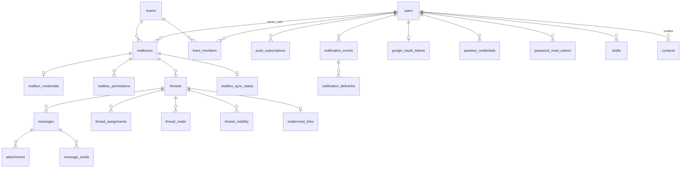

# データベース

> 最終更新: 2026-04-12  
> スキーマファイル: `prisma/schema.prisma`

---

## DB概要

- **DB**: PostgreSQL 16
- **ORM**: Prisma ^5.13.0
- **スキーマ**: `prisma/schema.prisma`（唯一の情報源）
- **migration**: `prisma/migrations/` に10ファイル（2026-04-10 〜 2026-04-12）
- **接続**: `DATABASE_URL` 環境変数で設定

---

## Enum 一覧

| Enum名 | 値 |
|---|---|
| `MailboxType` | `personal`, `team` |
| `MessageDirection` | `incoming`, `outgoing` |
| `ThreadStatus` | `open`, `in_progress`, `waiting`, `done`, `archived` |
| `JobStatus` | `pending`, `success`, `failed` |
| `NotificationPriority` | `high`, `normal`, `low` |
| `AuthType` | `password`, `oauth` |

---

## ER図（概略）

---

## モデル詳細

### `users`

ユーザーアカウント。

| カラム | 型 | NULL | Default | 備考 |
|---|---|---|---|---|
| `id` | String | No | cuid() | PK |
| `name` | String | No | — | 表示名 |
| `email` | String | No | — | UNIQUE |
| `password_hash` | String | Yes | — | scryptハッシュ。パスキーのみの場合はnull可 |
| `role` | String | No | `"user"` | `"user"` または `"admin"` |
| `mattermost_user_id` | String | Yes | — | Mattermost連携用 |
| `mattermost_link_status` | String | Yes | — | |
| `signature` | String | Yes | — | メール署名 |
| `created_at` | DateTime | No | now() | |
| `updated_at` | DateTime | No | updatedAt | |

---

### `teams`

チーム組織。

| カラム | 型 | NULL | Default | 備考 |
|---|---|---|---|---|
| `id` | String | No | cuid() | PK |
| `name` | String | No | — | チーム名 |
| `created_at` | DateTime | No | now() | |
| `updated_at` | DateTime | No | updatedAt | |

---

### `team_members`

チームメンバーシップ。

| カラム | 型 | NULL | Default | 備考 |
|---|---|---|---|---|
| `id` | String | No | cuid() | PK |
| `team_id` | String | No | — | FK → teams |
| `user_id` | String | No | — | FK → users |
| `role` | String | No | `"member"` | |
| `created_at` | DateTime | No | now() | |

**Unique制約**: `(team_id, user_id)`

---

### `mailboxes`

メールボックス（個人・チーム両方）。

| カラム | 型 | NULL | Default | 備考 |
|---|---|---|---|---|
| `id` | String | No | cuid() | PK |
| `type` | MailboxType | No | — | `personal` or `team` |
| `display_name` | String | No | — | 表示名 |
| `email_address` | String | No | — | メールアドレス |
| `owner_user_id` | String | Yes | — | FK → users（personalは設定、teamはnull） |
| `team_id` | String | Yes | — | FK → teams |
| `is_active` | Boolean | No | true | 同期対象フラグ |
| `mattermost_channel_id` | String | Yes | — | Mattermostチャンネル連携 |
| `cached_size_bytes` | BigInt | Yes | — | 容量キャッシュ |
| `size_cached_at` | DateTime | Yes | — | 容量キャッシュ日時 |
| `created_at` | DateTime | No | now() | |
| `updated_at` | DateTime | No | updatedAt | |

---

### `mailbox_credentials`

IMAPおよびSMTP接続情報（パスワードはAES-GCM暗号化）。

| カラム | 型 | NULL | Default | 備考 |
|---|---|---|---|---|
| `id` | String | No | cuid() | PK |
| `mailbox_id` | String | No | — | FK → mailboxes（UNIQUE） |
| `username` | String | No | — | IMAPユーザー名 |
| `encrypted_password` | String | No | — | AES-GCM暗号化パスワード |
| `encryption_key_version` | String | No | — | 暗号鍵バージョン（例: `"v1"`） |
| `auth_type` | AuthType | No | `password` | |
| `imap_host` | String | No | — | |
| `imap_port` | Int | No | — | |
| `imap_secure` | Boolean | No | — | SSL/TLS |
| `smtp_host` | String | No | — | |
| `smtp_port` | Int | No | — | |
| `smtp_secure` | Boolean | No | — | |
| `last_tested_at` | DateTime | Yes | — | |
| `last_test_status` | String | Yes | — | `"ok"` or エラーメッセージ |
| `last_error` | String | Yes | — | |
| `created_at` | DateTime | No | now() | |
| `updated_at` | DateTime | No | updatedAt | |

---

### `mailbox_permissions`

メールボックスへのユーザー別アクセス権限。

| カラム | 型 | NULL | Default | 備考 |
|---|---|---|---|---|
| `id` | String | No | cuid() | PK |
| `mailbox_id` | String | No | — | FK → mailboxes |
| `user_id` | String | No | — | FK → users |
| `can_view` | Boolean | No | `true` | 閲覧権限 |
| `can_reply` | Boolean | No | `false` | 返信権限 |
| `can_assign` | Boolean | No | `false` | 担当変更権限 |
| `created_at` | DateTime | No | now() | |

**Unique制約**: `(mailbox_id, user_id)`

> **注意**: 管理者（`role='admin'`）とメールボックスオーナー（`owner_user_id`）はこのテーブルに関係なく全権限を持つ。チームメールボックスのみで使用。

---

### `threads`

メールスレッド（1スレッド = 1メール往復の束）。

| カラム | 型 | NULL | Default | 備考 |
|---|---|---|---|---|
| `id` | String | No | cuid() | PK |
| `mailbox_id` | String | No | — | FK → mailboxes |
| `subject` | String | No | — | 元件名 |
| `normalized_subject` | String | No | — | 正規化件名（スレッドマッチング用） |
| `status` | ThreadStatus | No | `open` | |
| `assigned_user_id` | String | Yes | — | FK → users |
| `last_message_at` | DateTime | No | — | 最後のメッセージ日時 |
| `last_received_at` | DateTime | Yes | — | |
| `last_sent_at` | DateTime | Yes | — | |
| `last_replied_by_user_id` | String | Yes | — | FK → users |
| `unread_count` | Int | No | 0 | 個人メール用未読カウント |
| `is_archived` | Boolean | No | false | |
| `created_at` | DateTime | No | now() | |
| `updated_at` | DateTime | No | updatedAt | |

---

### `messages`

個別メールメッセージ。

| カラム | 型 | NULL | Default | 備考 |
|---|---|---|---|---|
| `id` | String | No | cuid() | PK |
| `thread_id` | String | No | — | FK → threads |
| `mailbox_id` | String | No | — | FK → mailboxes |
| `external_message_id` | String | No | — | UNIQUE。Message-IDヘッダ値または `local:{uuid}` |
| `imap_uid` | Int | Yes | — | IMAP UID（受信メールのみ） |
| `in_reply_to` | String | Yes | — | In-Reply-Toヘッダ値 |
| `references_raw` | String | Yes | — | Referencesヘッダ値（スペース区切り） |
| `direction` | MessageDirection | No | — | `incoming` or `outgoing` |
| `from_name` | String | Yes | — | 送信者名 |
| `from_email` | String | No | — | 送信者メールアドレス |
| `to_raw` | String | No | — | 宛先（カンマ区切り文字列） |
| `cc_raw` | String | Yes | — | CC |
| `bcc_raw` | String | Yes | — | BCC |
| `subject` | String | No | — | 件名 |
| `text_body` | String | Yes | — | テキスト本文 |
| `html_body` | String | Yes | — | HTML本文 |
| `sent_at` | DateTime | No | — | 送信/受信日時 |
| `received_at` | DateTime | Yes | — | IMAPで受信した日時 |
| `raw_headers` | String | Yes | — | 生ヘッダ（将来用、現在は基本null） |
| `has_attachments` | Boolean | No | false | |
| `created_at` | DateTime | No | now() | |

---

### `attachments`

添付ファイルメタデータ。

| カラム | 型 | NULL | Default | 備考 |
|---|---|---|---|---|
| `id` | String | No | cuid() | PK |
| `message_id` | String | No | — | FK → messages |
| `filename` | String | No | — | |
| `content_type` | String | No | — | MIMEタイプ |
| `size` | Int | No | — | バイト数 |
| `storage_key` | String | No | — | `storage/attachments/{uuid}{ext}` |
| `created_at` | DateTime | No | now() | |

---

### `thread_reads`

チームスレッドのユーザー別既読管理。

| カラム | 型 | NULL | Default | 備考 |
|---|---|---|---|---|
| `id` | String | No | cuid() | PK |
| `thread_id` | String | No | — | FK → threads（CASCADE） |
| `user_id` | String | No | — | FK → users（CASCADE） |
| `last_read_at` | DateTime | No | now() | |

**Unique制約**: `(thread_id, user_id)`

---

### `thread_assignments`

スレッド担当履歴。

| カラム | 型 | NULL | Default | 備考 |
|---|---|---|---|---|
| `id` | String | No | cuid() | PK |
| `thread_id` | String | No | — | FK → threads |
| `assigned_to_user_id` | String | Yes | — | FK → users（解除時はnull） |
| `assigned_by_user_id` | String | No | — | FK → users |
| `created_at` | DateTime | No | now() | |

---

### `thread_state_history`

スレッドステータス変更履歴。

| カラム | 型 | NULL | Default | 備考 |
|---|---|---|---|---|
| `id` | String | No | cuid() | PK |
| `thread_id` | String | No | — | FK → threads |
| `old_status` | ThreadStatus | Yes | — | null = 初回設定 |
| `new_status` | ThreadStatus | No | — | |
| `changed_by_user_id` | String | No | — | FK → users |
| `created_at` | DateTime | No | now() | |

---

### `thread_visibility`

スレッドの個人非表示設定（per-user）。

| カラム | 型 | NULL | Default | 備考 |
|---|---|---|---|---|
| `id` | String | No | cuid() | PK |
| `thread_id` | String | No | — | FK → threads |
| `user_id` | String | No | — | FK → users |
| `is_hidden` | Boolean | No | false | |
| `hidden_at` | DateTime | Yes | — | |
| `created_at` | DateTime | No | now() | |
| `updated_at` | DateTime | No | updatedAt | |

**Unique制約**: `(thread_id, user_id)`

---

### `message_sends`

SMTP送信ジョブの記録。

| カラム | 型 | NULL | Default | 備考 |
|---|---|---|---|---|
| `id` | String | No | cuid() | PK |
| `message_id` | String | No | — | FK → messages |
| `thread_id` | String | No | — | FK → threads |
| `mailbox_id` | String | No | — | FK → mailboxes |
| `sent_by_user_id` | String | No | — | FK → users |
| `smtp_response` | String | Yes | — | SMTP応答 |
| `status` | JobStatus | No | — | `pending`/`success`/`failed` |
| `error_message` | String | Yes | — | 失敗時エラー |
| `sent_at` | DateTime | No | — | |

---

### `mailbox_sync_states`

メールボックスのIMAP同期状態。

| カラム | 型 | NULL | Default | 備考 |
|---|---|---|---|---|
| `id` | String | No | cuid() | PK |
| `mailbox_id` | String | No | — | FK → mailboxes（UNIQUE） |
| `last_sync_started_at` | DateTime | Yes | — | |
| `last_sync_finished_at` | DateTime | Yes | — | |
| `last_success_at` | DateTime | Yes | — | |
| `last_error` | String | Yes | — | |
| `last_seen_uid` | String | Yes | — | IMAP UID追跡（差分取得用） |
| `status` | String | No | — | `"syncing"`, `"idle"`, `"error"` 等 |
| `updated_at` | DateTime | No | updatedAt | |

---

### `push_subscriptions`

Web Push購読情報。

| カラム | 型 | NULL | Default | 備考 |
|---|---|---|---|---|
| `id` | String | No | cuid() | PK |
| `user_id` | String | No | — | FK → users |
| `endpoint` | String | No | — | UNIQUE。Push Serviceエンドポイント |
| `p256dh` | String | No | — | ECDH公開鍵 |
| `auth` | String | No | — | 認証シークレット |
| `platform` | String | No | — | ブラウザ識別（`chrome`, `safari`等） |
| `user_agent` | String | No | — | |
| `is_active` | Boolean | No | true | 410/404エラー時に自動で`false`に |
| `last_seen_at` | DateTime | Yes | — | |
| `created_at` | DateTime | No | now() | |
| `updated_at` | DateTime | No | updatedAt | |

---

### `notification_events`

通知イベント（送信予定・送信済みの通知記録）。

| カラム | 型 | NULL | Default | 備考 |
|---|---|---|---|---|
| `id` | String | No | cuid() | PK |
| `user_id` | String | No | — | FK → users |
| `thread_id` | String | Yes | — | FK → threads |
| `event_type` | String | No | — | 例: `"new_message"` |
| `title` | String | No | — | 通知タイトル |
| `body` | String | No | — | 通知本文 |
| `url` | String | No | — | クリック時の遷移先 |
| `priority` | NotificationPriority | No | — | `high`/`normal`/`low` |
| `created_at` | DateTime | No | now() | |

---

### `notification_deliveries`

通知の配信結果記録。

| カラム | 型 | NULL | Default | 備考 |
|---|---|---|---|---|
| `id` | String | No | cuid() | PK |
| `notification_event_id` | String | No | — | FK → notification_events |
| `channel` | String | No | — | 配信チャンネル（例: `"push"`） |
| `status` | JobStatus | No | — | |
| `response_code` | Int | Yes | — | HTTPレスポンスコード |
| `error_message` | String | Yes | — | |
| `delivered_at` | DateTime | Yes | — | |
| `created_at` | DateTime | No | now() | |

---

### `mattermost_links`

スレッドとMattermostポストのリンク。

| カラム | 型 | NULL | Default | 備考 |
|---|---|---|---|---|
| `id` | String | No | cuid() | PK |
| `thread_id` | String | No | — | FK → threads（UNIQUE） |
| `mattermost_channel_id` | String | No | — | |
| `mattermost_post_id` | String | No | — | |
| `mattermost_root_post_id` | String | No | — | |
| `permalink` | String | No | — | |
| `created_by_user_id` | String | No | — | FK → users |
| `created_at` | DateTime | No | now() | |

---

### `mattermost_notifications`

Mattermost通知ジョブ記録。

| カラム | 型 | NULL | Default | 備考 |
|---|---|---|---|---|
| `id` | String | No | cuid() | PK |
| `thread_id` | String | Yes | — | FK → threads |
| `user_id` | String | No | — | FK → users |
| `notification_type` | String | No | — | |
| `target_mattermost_id` | String | No | — | |
| `status` | JobStatus | No | — | |
| `error_message` | String | Yes | — | |
| `created_at` | DateTime | No | now() | |

---

### `mattermost_forwards`

Mattermost転送ジョブ記録。

| カラム | 型 | NULL | Default | 備考 |
|---|---|---|---|---|
| `id` | String | No | cuid() | PK |
| `thread_id` | String | No | — | FK → threads |
| `message_id` | String | Yes | — | FK → messages |
| `forwarded_by_user_id` | String | No | — | FK → users |
| `target_channel_id` | String | No | — | |
| `target_post_id` | String | Yes | — | |
| `status` | JobStatus | No | — | |
| `error_message` | String | Yes | — | |
| `created_at` | DateTime | No | now() | |

---

### `audit_logs`

操作監査ログ。

| カラム | 型 | NULL | Default | 備考 |
|---|---|---|---|---|
| `id` | String | No | cuid() | PK |
| `actor_user_id` | String | Yes | — | FK → users（null=システム操作） |
| `action_type` | String | No | — | 操作種別（例: `"assign_thread"`, `"change_status"`） |
| `target_type` | String | No | — | 対象種別（例: `"threads"`, `"mailboxes"`） |
| `target_id` | String | Yes | — | 対象ID |
| `metadata_json` | String | No | — | JSON文字列（追加情報） |
| `created_at` | DateTime | No | now() | |

---

### `app_settings`

管理者が設定するアプリ設定のKVストア。

| カラム | 型 | NULL | Default | 備考 |
|---|---|---|---|---|
| `id` | String | No | cuid() | PK |
| `key` | String | No | — | UNIQUE |
| `value` | String | No | — | |
| `is_secret` | Boolean | No | false | シークレット表示制御フラグ |
| `updated_by` | String | Yes | — | 最終更新ユーザーID |
| `updated_at` | DateTime | No | updatedAt | |
| `created_at` | DateTime | No | now() | |

**管理キー一覧** (`src/lib/settings.ts` より):
- `VAPID_PUBLIC_KEY`
- `VAPID_PRIVATE_KEY`
- `VAPID_SUBJECT`
- `MATTERMOST_BASE_URL`
- `MATTERMOST_BOT_TOKEN`
- `MATTERMOST_DEFAULT_CHANNEL_ID`
- `SYNC_DEFAULT_INTERVAL_SEC`

---

### `passkey_credentials`

WebAuthn パスキー資格情報。

| カラム | 型 | NULL | Default | 備考 |
|---|---|---|---|---|
| `id` | String | No | cuid() | PK |
| `user_id` | String | No | — | FK → users（CASCADE） |
| `credential_id` | String | No | — | UNIQUE |
| `public_key` | Bytes | No | — | CBOR公開鍵 |
| `counter` | BigInt | No | 0 | リプレイ攻撃防止カウンタ |
| `device_type` | String | No | `"singleDevice"` | |
| `backed_up` | Boolean | No | false | クラウドバックアップ有無 |
| `transports` | String | Yes | — | `"internal,hybrid"` 等 |
| `aaguid` | String | Yes | — | 認証器ID |
| `name` | String | No | `"パスキー"` | ユーザー表示名 |
| `created_at` | DateTime | No | now() | |
| `last_used_at` | DateTime | Yes | — | |

---

### `contacts`

社内共有アドレス帳。

| カラム | 型 | NULL | Default | 備考 |
|---|---|---|---|---|
| `id` | String | No | cuid() | PK |
| `name` | String | No | — | |
| `email` | String | Yes | — | |
| `phone` | String | Yes | — | |
| `company` | String | Yes | — | |
| `department` | String | Yes | — | |
| `notes` | String | Yes | — | |
| `source` | String | No | `"manual"` | `"manual"` or `"google"` |
| `google_id` | String | Yes | — | UNIQUE。Google連絡先ID |
| `created_by` | String | Yes | — | FK → users |
| `created_at` | DateTime | No | now() | |
| `updated_at` | DateTime | No | updatedAt | |

---

### `google_oauth_tokens`

Google APIアクセストークン（コンタクト同期用）。

| カラム | 型 | NULL | Default | 備考 |
|---|---|---|---|---|
| `id` | String | No | cuid() | PK |
| `user_id` | String | No | — | FK → users（UNIQUE、CASCADE） |
| `encrypted_token` | String | No | — | AES-GCM暗号化JSON |
| `created_at` | DateTime | No | now() | |
| `updated_at` | DateTime | No | updatedAt | |

---

### `password_reset_tokens`

パスワードリセットトークン。

| カラム | 型 | NULL | Default | 備考 |
|---|---|---|---|---|
| `id` | String | No | cuid() | PK |
| `user_id` | String | No | — | FK → users（CASCADE） |
| `token` | String | No | cuid() | UNIQUE |
| `expires_at` | DateTime | No | — | 有効期限 |
| `used` | Boolean | No | false | 使用済みフラグ |
| `created_at` | DateTime | No | now() | |

---

### `drafts`

メール下書き。

| カラム | 型 | NULL | Default | 備考 |
|---|---|---|---|---|
| `id` | String | No | cuid() | PK |
| `user_id` | String | No | — | FK → users |
| `mailbox_id` | String | Yes | — | FK → mailboxes |
| `thread_id` | String | Yes | — | FK → threads（返信時） |
| `to_raw` | String | Yes | — | |
| `cc_raw` | String | Yes | — | |
| `subject` | String | Yes | — | |
| `html_body` | String | Yes | — | |
| `text_body` | String | Yes | — | |
| `is_shared` | Boolean | No | false | チーム共有フラグ |
| `created_at` | DateTime | No | now() | |
| `updated_at` | DateTime | No | updatedAt | |

---

## データ整合性の注意点

1. **メールパスワードの鍵バージョン**: `mailbox_credentials.encryption_key_version` が `ENCRYPTION_KEY_HEX` と一致しなければ復号不可。鍵をローテーションする際は全レコードを再暗号化する必要がある。
2. **スレッドの未読管理**: `threads.unread_count` は個人メール用。チームメールは `thread_reads` テーブルを使用する。
3. **スレッドの `is_archived` フラグ**: DB 上は存在するが、現在のUIでは使用していない（要確認）。
4. **削除カスケード**: `passkey_credentials`, `google_oauth_tokens`, `password_reset_tokens`, `thread_reads` の一部は `onDelete: Cascade` が設定されている。`threads` 削除時に `thread_reads` も自動削除される。

---

## migration 運用状況

| migration | 内容 |
|---|---|
| 20260410224434_init | コアスキーマ（全基本テーブル） |
| 20260410233041_add_user_signature | `users.signature` 追加 |
| 20260411043903_add_drafts_session_activity | `drafts` テーブル追加 |
| 20260411081723_add_passkeys | `passkey_credentials` 追加 |
| 20260411083829_add_contacts | `contacts`, `google_oauth_tokens` 追加 |
| 20260411091910_add_thread_reads | `thread_reads` 追加 |
| 20260411091955_add_imap_uid_to_messages | `messages.imap_uid` 追加 |
| 20260411093702_add_password_reset_tokens | `password_reset_tokens` 追加 |
| 20260411173232_add_mailbox_mattermost_channel | `mailboxes.mattermost_channel_id` 追加 |
| 20260412023959_add_mailbox_size_cache | `mailboxes.cached_size_bytes`, `size_cached_at` 追加 |
| 20260412054841_remove_mattermost_username | `users.mattermost_username` 削除 |

---

## DBスキーマ変更時の注意点

1. `prisma/schema.prisma` を編集
2. `npx prisma migrate dev --name <変更名>` で migration ファイルを生成
3. `npx prisma generate` でPrismaクライアントを再生成
4. 開発サーバーを再起動（古いクライアントがメモリにキャッシュされるため）
5. `docs/06_database.md` と `docs/appendix_schema_reference.md` を更新

---

## 更新時チェック項目

- `prisma/schema.prisma` が変更されたら本ドキュメントのモデル定義テーブルを更新すること
- Enum の値が変更された場合は Enum 一覧テーブルを更新すること
- migration を追加した場合は「migration 運用状況」テーブルを更新すること
